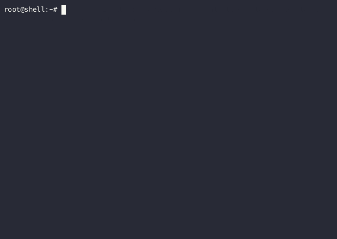

# STAKEWORLD.nl scripts

Scripts focussed on running a polkadot/kusama node. All written in bash.

## clone repo

You can run it in /opt or any location you like

```
cd /opt
git clone git@github.com:stakeworld/stakeworld-scripts.git
```

## included scripts
* node-install.sh: a polkadot/kusama node and snapshot installer.
You can start an automatic installer by:
```
curl -o- -L https://raw.githubusercontent.com/stakeworld/stakeworld-scripts/master/node-install.sh | bash
```

* keystore-backup.sh: make a backup of the polkadot instances excluding the database, so the keystore and network keys. Also backup the /etc directory. Preferably mount an remote backup storage or export backups to remote storage.
